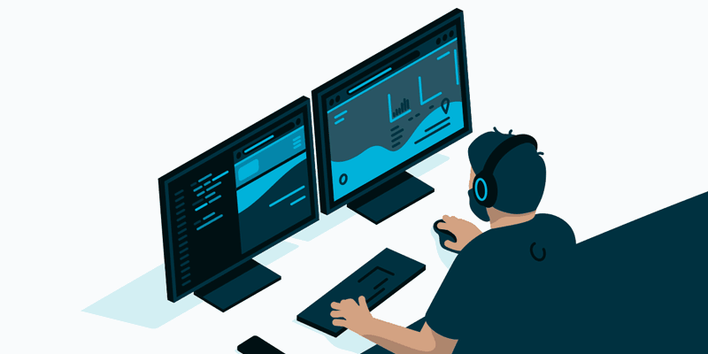

<!-- ═══════════════════════════════════════════════════════════════
     HABIBI AHMAD AZIZ · GitHub Profile README
     Source of truth: https://www.habibiahmada.dev
     ⚠ Edit this file as raw text. Visual/WYSIWYG markdown editors
       strip the HTML below and break the layout.
     ═══════════════════════════════════════════════════════════════ -->

<!-- ░░░ HERO ░░░ -->

<!-- ░░░ ABOUT ░░░ -->
<h2 align="center">&nbsp; About Me</h2>

<table>
  <tr>
    <td align="center" width="22%">
       
      <b>Toothless</b>
    </td>
    <td width="56%">
      &nbsp; Web Developer @ <b>PT Webekspres Teknologi</b>  
      &nbsp; AWS &amp; Alibaba Cloud certified  
      &nbsp; Software Engineering · <b>SMKN 1 Karawang</b>  
      &nbsp; Clear interfaces <i>and</i> the APIs behind them  
      &nbsp; Performance you can <b>measure</b>
    </td>
    <td align="center" width="22%">
       
      <b>Light Fury</b>
    </td>
  </tr>
</table>

 

<!-- ░░░ JOURNEY ░░░ -->
<h2 align="center">&nbsp; Journey</h2>

<table>
  <tr>
    <th width="22%">Year</th>
    <th width="42%">Role</th>
    <th width="36%">Where</th>
  </tr>
  <tr>
    <td align="center"> <code>2026 – now</code></td>
    <td>&nbsp; <b>Web Developer</b></td>
    <td>PT Webekspres Teknologi</td>
  </tr>
  <tr>
    <td align="center"><code>2025</code></td>
    <td>&nbsp; Cloud Computing Trainer</td>
    <td>Yayasan Sagasitas Indonesia</td>
  </tr>
  <tr>
    <td align="center"><code>2025</code></td>
    <td>&nbsp; Coding Camp · Top 15 Capstone</td>
    <td>DBS Foundation × Dicoding</td>
  </tr>
  <tr>
    <td align="center"><code>2025</code></td>
    <td>&nbsp; Web Developer Intern</td>
    <td>CV. SmartPlus Indonesia</td>
  </tr>
  <tr>
    <td align="center"><code>2023 – 26</code></td>
    <td>&nbsp; Software Engineering</td>
    <td>SMK Negeri 1 Karawang</td>
  </tr>
</table>

<!-- ░░░ TECH ░░░ -->
<h2 align="center">&nbsp; Tech Stack</h2>

<table>
  <tr>
    <td align="center" width="22%"><b>Frontend</b></td>
    <td></td>
  </tr>
  <tr>
    <td align="center"><b>Backend</b></td>
    <td></td>
  </tr>
  <tr>
    <td align="center"><b>Cloud &amp; Tools</b></td>
    <td></td>
  </tr>
</table>

<!-- ░░░ PROJECTS ░░░ -->
<h2 align="center">&nbsp; Featured Projects</h2>

<table>
  <tr>
    <td align="center" valign="top" width="33%">
       
      <a href="https://www.habibiahmada.dev/projects/jepangku"><b>JepangKu</b></a> 
      News portal with quizzes &amp; XP  
        
      
    </td>
    <td align="center" valign="top" width="33%">
       
      <a href="https://www.habibiahmada.dev/projects/bagiberkah"><b>BagiBerkah</b></a> 
      Digital THR with mini-games  
        
      
    </td>
    <td align="center" valign="top" width="33%">
       
      <a href="https://www.habibiahmada.dev/projects/terraju"><b>Terraju</b></a> 
      Regional destination directory  
        
      
    </td>
  </tr>
  <tr>
    <td align="center" valign="top" width="33%">
       
      <a href="https://www.habibiahmada.dev/projects/e-vote"><b>E-Vote</b></a> 
      Digital OSIS school elections  
        
      
    </td>
    <td align="center" valign="top" width="33%">
       
      <a href="https://www.habibiahmada.dev/projects/culture-connect"><b>CultureConnect</b></a> 
      AI for cultural travel  
        
      
    </td>
    <td align="center" valign="top" width="33%">
       
      <a href="https://www.habibiahmada.dev/projects/agrify"><b>Smartfarm AI</b></a> 
      ML insights for farmers  
        
      
    </td>
  </tr>
</table>

<!-- ░░░ AWARDS ░░░ -->
<h2 align="center">&nbsp; Wins &amp; Certs</h2>

 

<!-- ░░░ STATS ░░░ -->
<h2 align="center">&nbsp; GitHub Pulse</h2>

<table>
  <tr>
    <td align="center" width="50%">
      
    </td>
    <td align="center" width="50%">
      
    </td>
  </tr>
  <tr>
    <td align="center" colspan="2">
      
    </td>
  </tr>
  <tr>
    <td align="center" colspan="2">
      
    </td>
  </tr>
</table>

<picture>
  <source media="(prefers-color-scheme: dark)" srcset="https://raw.githubusercontent.com/habibiahmada/habibiahmada/output/github-snake-dark.svg"/>
  <source media="(prefers-color-scheme: light)" srcset="https://raw.githubusercontent.com/habibiahmada/habibiahmada/output/github-snake.svg"/>
  
</picture>

<!-- ░░░ VIBES ░░░ -->
<h2 align="center">&nbsp; Off the Clock</h2>

<b>Recent GitHub activity</b>

 

<!--START_SECTION:activity-->
<!--END_SECTION:activity-->

<!-- ░░░ CONNECT ░░░ -->
<h2 align="center">&nbsp; Let's Connect</h2>

 

