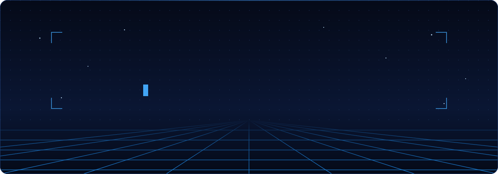

  
  
  
  
  
  

### Hi, I'm Habibi.

I'm a frontend-leaning fullstack developer in Karawang, Indonesia. I build web products end to end: the interface people touch and the API behind it. I care about performance I can measure, not performance I can claim.

Right now I'm a Web Developer at **PT Webekspres Teknologi Indonesia**, where I've shipped 19 client websites in about four months for businesses, government agencies and schools.

You can also find me in a terminal: `npx habibiahmada` or `ssh ssh.habibiahmada.dev`.

### Experience

- **Web Developer** · PT Webekspres Teknologi Indonesia · *2026 to now*
- **Coding Camp, top 15 capstone team** · DBS Foundation × Dicoding · *2025*
- **Web Developer Intern** · CV. SmartPlus Indonesia · *2025*
- **Software Engineering** · SMK Negeri 1 Karawang · *2023 to 2026*

### Selected work

- **[JepangKu](https://jepangku.com)** · News portal with quizzes, polls and XP gamification. *Next.js, React, Elysia, Clerk*
- **[BagiBerkah](https://bagiberkah.vercel.app)** · A digital THR experience with mini-games. *Next.js, Express*
- **[Terraju](https://terraju.id)** · Regional directory for destinations and local UMKM. *WordPress, Elementor*
- **[E-Vote](https://vote.smkn1karawang.sch.id/)** · Digital OSIS elections for SMKN 1 Karawang. *Laravel, PHP*
- **[CultureConnect](https://culture-connect-iota.vercel.app/)** · AI platform for cultural travel. *Python, React*
- **[Smartfarm AI](https://www.habibiahmada.dev/projects/agrify)** · ML-assisted insights for farmers. *React, Python*

Write-ups for each are at [habibiahmada.dev/projects](https://www.habibiahmada.dev/projects).

### Recognition

- **Intel® AI Global Impact Festival 2025**, Indonesia Country Award, for Smartfarm AI
- **Coding Camp × DBS Foundation**, top 15 capstone team, graduated with distinction
- **Certified** in AWS, Alibaba Cloud, and Fullstack Web Development (Kemnaker)

### Stack

### On GitHub

---

  
  
   
  Have something to build? <a href="mailto:habibiahmadaziz@gmail.com">habibiahmadaziz@gmail.com</a>

