<!-- Header Banner -->

<!-- Typing Animation -->

<!-- Profile Views & Social Badges -->

---

## 👋 About Me

<table>
<tr>
<td width="60%" valign="top">

Hi! I'm **Habibi Ahmad Aziz**, a Fullstack Developer from Indonesia 🇮🇩 with a strong focus on **Cloud Computing, Artificial Intelligence, and Modern Web Technologies**.

🏆 **Intel® AI Global Impact Festival 2025 – Country Award Winner (Indonesia)**
🏆 **Top 15 Best Capstone Team – Coding Camp powered by DBS Foundation**
🎓 **Coding Camp Graduate with Distinction (Front-End & Back-End Developer Track)**
☁️ **AWS Cloud Computing Trainer**
🏫 Student at **SMKN 1 Karawang**

I specialize in building scalable web applications and AI-driven solutions. My work bridges practical software engineering with real-world impact — from AI-powered systems to fullstack platforms designed for production environments.

Currently advancing my expertise in:

* Cloud architecture & AWS infrastructure
* AI integration in web systems
* Scalable backend design
* Modern React & JavaScript ecosystems

I believe in engineering solutions that are not only functional — but strategic and impactful.

 

| 🔭 | Building AI & Cloud-based systems                             |
| -- | ------------------------------------------------------------- |
| ☁️ | AWS Cloud Computing Trainer                                   |
| 🏆 | Intel AI GIF 2025 Winner                                      |
| 🏫 | SMKN 1 Karawang                                               |
| 💬 | Focus: JavaScript, React, AI, Cloud                           |
| 📫 | [habibiahmadaziz@gmail.com](mailto:habibiahmadaziz@gmail.com) |
| 🤝 | Open for high-impact collaborations                           |

</td>
<td width="40%" align="center" valign="middle">

 

> *"The best way to learn is to build. The best way to lead is to ship."*

</td>
</tr>
</table>

---

## 🌐 Connect With Me

---

## 🛠️ Tech Stack & Tools

### 🌐 Frontend Development

### 🎨 Styling & UI

### 🗄️ Backend & Database

### ☁️ Cloud & DevOps

### 🔧 Version Control & Collaboration

---

## 📊 GitHub Statistics

---

## 📈 Contribution Activity

---

## 🏆 GitHub Trophies

---

## 🎵 Currently Listening

---

## 🐍 Contribution Snake

---

## 📚 Currently Learning & Roadmap

```mermaid
graph LR
    A[📚 2026 Learning Roadmap] --> B[🌐 Advanced Go & Web3 Development]
    A --> C[🔙 Backend Optimization]
    A --> D[☁️ AWS Certified Developer]
    A --> E[🛢️ Database Optimization]
    A --> F[🐳 Docker & Containerization]
    A --> G[🤖 AI/ML Integration in Web Apps]

    %% Advanced Go & Web3 Breakdown
    B --> B1[Concurrency & Goroutines]
    B --> B2[Clean Architecture in Go]
    B --> B3[Smart Contracts]
    B --> B4[Blockchain Integration]

    %% Backend Optimization Breakdown
    C --> C1[System Design]
    C --> C2[Scalability & Caching]
    C --> C3[API Performance Tuning]
    C --> C4[Security Best Practices]

    %% AWS Breakdown
    D --> D1[EC2 & VPC]
    D --> D2[S3 & CloudFront]
    D --> D3[Lambda & Serverless]
    D --> D4[CI/CD with CodePipeline]

    %% Database Breakdown
    E --> E1[Indexing & Query Optimization]
    E --> E2[Normalization vs Denormalization]
    E --> E3[Replication & Partitioning]
    E --> E4[Performance Monitoring]

    %% Docker Breakdown
    F --> F1[Dockerfile Optimization]
    F --> F2[Multi-stage Builds]
    F --> F3[Docker Compose]
    F --> F4[Kubernetes Basics]

    %% AI/ML Breakdown
    G --> G1[Model Integration via API]
    G --> G2[Vector Databases]
    G --> G3[AI Agents]
    G --> G4[LLM-powered Features]

```

---

### 💡 Random Dev Quote

---

<!-- Footer Wave -->

**Thanks for visiting! Let's build something amazing together 🚀**

